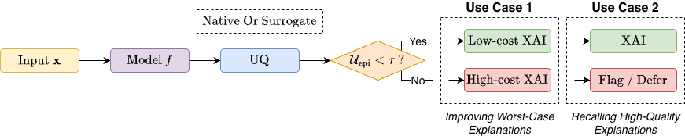

# UQ-XAI

This repository accompanies the paper "Uncertainty Gating for Cost-Aware Explainable Artificial Intelligence".

Citation (placeholder):

```bibtex
@article{placeholder,
  title={Paper Title Placeholder},
  author={Author, A. and Author, B.},
  journal={Venue Placeholder},
  year={20XX}
}
```

## Description

This repository provides a framework for studying how epistemic uncertainty relates to XAI reliability in tabular and image settings. It includes model wrappers for uncertainty decomposition, perturbation and adversarial data generation, and explainer pipelines to measure stability and faithfulness. Scripts reproduce the epistemic gating experiments (adaptive XAI method routing and explanation deferral) and figures from the paper.

## Framework Overview



*Epistemic uncertainty is obtained from the model's native estimator or a 
lightweight surrogate, then used to route samples: Use Case 1 selects 
between low- and high-cost XAI methods; Use Case 2 defers high-uncertainty 
samples to save computation.*

## Installation

Python version used: 3.11.13

```bash
git clone https://github.com/comrados/uq-xai
cd uq-xai

pip install -r requirements.txt
```

## Project Structure

```
.
├── config/                # Global settings and experiment configuration
├── data/                  # Dataset loading, splitting, caching, perturbations
├── evaluation/            # Metrics for performance, uncertainty, explanations
├── experiments/           # Tabular experiments and analysis scripts
├── experiments_images/    # Image experiments and analysis scripts
├── explainers/            # SHAP, LIME, Integrated Gradients, SmoothGrad
├── images/                # Images for README.md
├── models/                # Base model implementations and registry
├── results/               # Generated outputs (tables, plots, pickles)
├── tables/                # LaTeX tables and artifacts for the paper
├── uncertainty/           # UQ wrappers and uncertainty decomposition
├── visualization/         # Plotting and table-generation utilities
├── LICENSE                # BSD-3-Clause license text
├── README.md              # This file
├── requirements.txt       # Main dependencies
└── exact_requirements.txt # Exact dependency snapshot
```

## License

BSD-3-Clause
